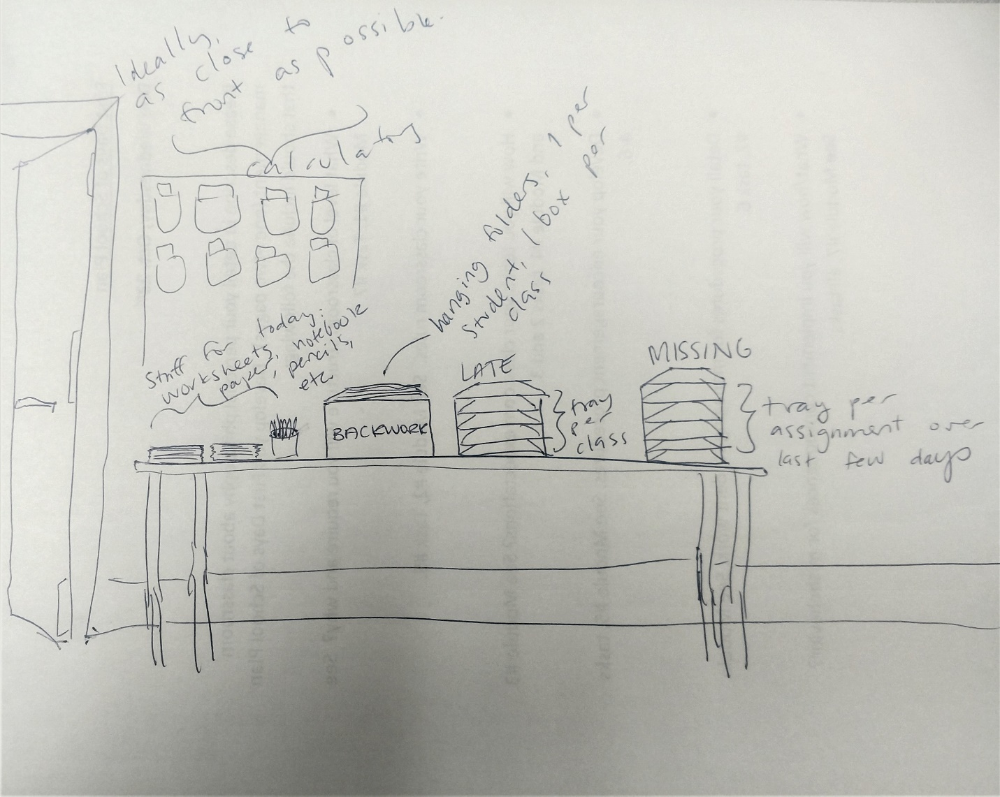

I do not enjoy spending class time getting ducks in a row instead of teaching, and I don't want any student to be unable to participate because they forgot supplies, so I figure why not create a one-stop-shop so my students can get absolutely everything they need as class starts! 

To accomplish this, I envision a giant work-management station, illustrated very haphazardly below. 

